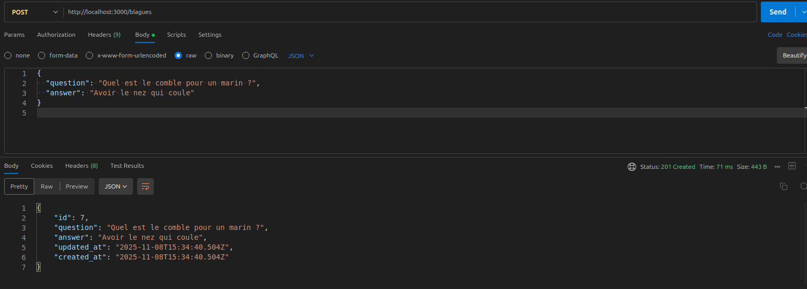

# Blagues API

Une API RESTful permettant de gérer et consulter des blagues.
Développée avec **Node.js**, **Express**, **Sequelize**, et **SQLite**, et déployée sur **Render**.

---

## Fonctionnalités

* Ajouter une blague en base de données (POST)
* Consulter toutes les blagues (GET)
* Consulter une blague spécifique (GET /:id)
* Consulter une blague aléatoire (GET /random)
* Documentation des routes via **Swagger**

---

## Stack technique

* Node.js
* Express
* Sequelize (ORM)
* SQLite
* Swagger (documentation)
* Render (hébergement)

---

## Installation locale

```bash
# 1. Cloner le repo
git clone https://github.com/LudivineLeLan/blagues-api-backend.git
cd blagues-api-backend

# 2. Installer les dépendances
npm install

# 3. Créer un fichier .env
# Exemple de contenu :
# PORT=3000

# 4. Créer la base de données et les tables
npm run db:create
npm run db:seed

# 5. Lancer le serveur
npm start
```

---

## Endpoints de l’API

| Méthode | Route             | Description                    |
| ------- | ----------------- | ------------------------------ |
| POST    | `/blagues`        | Ajouter une nouvelle blague    |
| GET     | `/blagues`        | Récupérer toutes les blagues   |
| GET     | `/blagues/:id`    | Récupérer une blague par ID    |
| GET     | `/blagues/random` | Récupérer une blague aléatoire |

---

## Documentation Swagger

La documentation est disponible via Swagger UI :

https://blagues-api-backend.onrender.com/api-docs/


---

## Exemple Postman




---

## Structure du projet

```
controllers/     # logique métier des routes
models/          # modèles Sequelize
routers/         # routes Express
migrations/      # scripts pour créer et remplir la base
swagger.js       # configuration Swagger
database.sqlite  # base de données SQLite
```

---

## Liens

* [Repo Backend](https://github.com/LudivineLeLan/blagues-api-backend.git)
* [Documentation Swagger](https://blagues-api-backend.onrender.com/api-docs/)
* [Repo Frontend](https://github.com/LudivineLeLan/blagues-api-frontend)
* [Déploiement sur Render](https://blagues-api-backend.onrender.com)
